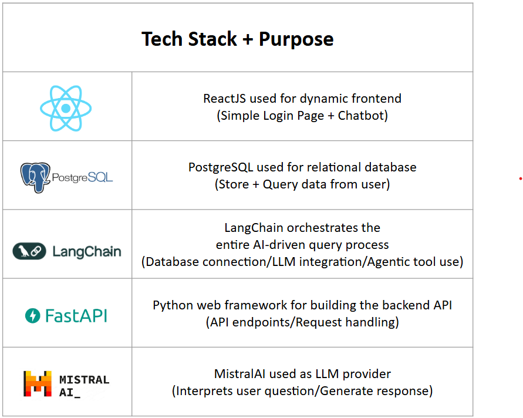
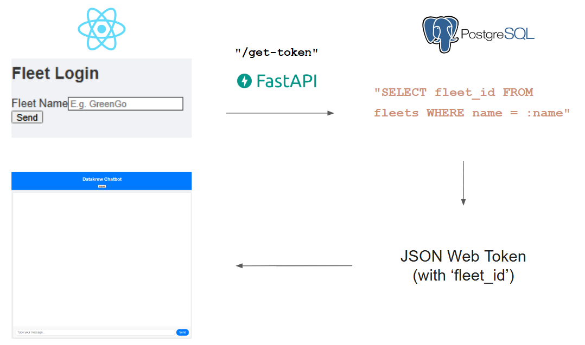
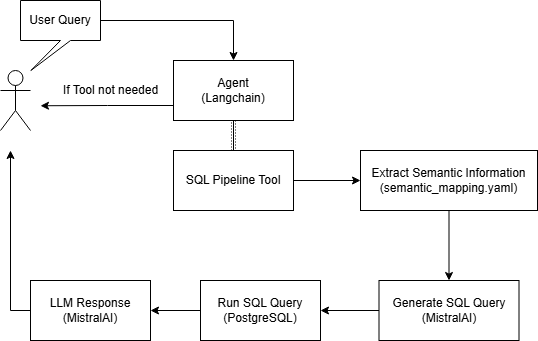

# Datakrew_Assignment
## Project Directory
```markdown
Datakrew_Assignment/
├── backend/
│   ├── agent_logs.log (A log file to track AI agent's operations)
│   ├── **automated_test.py** (Automated test using pytest --> Tested using 'fleet_id = 1' from mock data)
│   ├── Dockerfile (Build docker image for FastAPI service) 
│   ├── langchain_pipeline.py (Core logic for AI-driven query pipeline, built using Langchain tool-calling) 
│   ├── main.py (Main entry for FastAPI service)
│   ├── prompt_templates.py (Predefined prompt templates to guide LLM)
│   ├── requirements.txt
│   └── **semantic_mappings.yaml** (Contain mappings between Natural Language and DB Schema elements)
│   
├── database/
│   ├── clear_database.py (Cleaning script --> Clears current DB data)
│   ├── **import_data.py** (Import script --> Create schema + load csv from data folder)
│   ├── row_level_security.py (Set up RLS policies --> Fleet_id row filtering)
│   ├── schema.py (Defines database schema)
│   └── data/ (Mock csv data provided)
│       ├── alerts.csv
│       ├── battery_cycles.csv
│       ├── charging_sessions.csv
│       ├── drivers.csv
│       ├── driver_trip_map.csv
│       ├── fleets.csv
│       ├── fleet_daily_summary.csv
│       ├── geofence_events.csv
│       ├── maintenance_logs.csv
│       ├── processed_metrics.csv
│       ├── raw_telemetry.csv
│       ├── trips.csv
│       └── vehicles.csv
│
├── frontend/
│   ├── package.json
│   ├── package-lock.json
│   ├── Dockerfile (Build docker image for React frontend)
│   ├── .gitignore
│   └── src/
│       ├── App.css
│       ├── App.js (Main component of React application)
│       ├── ChatWindow.js (Renders chat interface)
│       ├── index.css 
│       ├── index.js
│       ├── Message.js (Renders chat messages)
│       ├── MessageInput.js (Renders chat input field)
│       ├── reportWebVitals.js
│       └── setupTests.js
│   
│
├── .env.example (Environment variables listed here)
├── .gitignore 
├── docker-compose.yml (Build multi-container docker application)
└── README.md
```
## Live Demo (on Render)
[Render Demo](https://datakrew-assignment-frontend-chatbot.onrender.com)

*Note: The demo backend use a free-tier API key which will rate limit very quickly. For testing purposes, please use the quick start guide below to run locally.

## 🚀 Quick Start Guide

Follow these steps to get the Datakrew Assignment up and running on your local machine.

### Prerequisites

Before you begin, ensure you have the following installed:

* **Git:** For cloning the repository.
    * [Download Git](https://git-scm.com/downloads)
* **Docker Desktop:** Includes Docker Engine and Docker Compose, essential for running our containerized application.
    * [Download Docker Desktop](https://www.docker.com/products/docker-desktop)

### Getting Started

1.  **Clone the Repository**
    - Start by cloning the project repository to your local machine using Git:

    ```bash
    git clone https://github.com/Kt159/Datakrew_Assignment.git
    cd Datakrew_Assignment
    ```
2.  **Configure Environment Variables**
    - The project relies on environment variables for database credentials, API keys, and other settings.
    * **Create your `.env` file:** 
        ```bash
        cp .env.example .env
        ```
    * Open the `.env` file and populate it with your specific details.

    *Example `.env` content:*
    ```text
    # Database Configuration
    DB_USER=your_db_user
    DB_PASSWORD=your_db_password
    DB_NAME=datakrew_db
    DB_HOST=postgres_db
    DB_PORT=5432
    URI=postgresql://${DB_USER}:${DB_PASSWORD}@${DB_HOST}:${DB_PORT}/${DB_NAME}

    #Set up lower access previllage for users
    APP_ROLE_NAME=fleet_users
    APP_ROLE_PASSWORD=fleet_password
    
    #Mistral API Key
    MISTRAL_API_KEY=your_mistral_api_key_here

    #Security (JWT)
    SECRET_KEY=mockup_secret_key
    ALGORITHM=HS256
    ACCESS_TOKEN_EXPIRE_MINUTES=30
    
    #API endpoints
    REACT_APP_API_URL=http://localhost:8000
    ```

3.  **Run the Application with Docker Compose**
    - Navigate to the root directory of the cloned repository (where `docker-compose.yml` is located) and run the following command to build and start all services:

    ```bash
    docker-compose up --build
    ```
    * The `--build` flag ensures that your Docker images are rebuilt, incorporating any recent code changes. This is important on the first run or after modifying Dockerfiles/dependencies.
    * This command will:
        * Build the `backend` and `frontend` Docker images.
        * Start the PostgreSQL database container.
        * Run the database initialization script (schema creation and data import).
        * Start the FastAPI backend service.
        * Start the React frontend development server.

### Verifying the Setup

Once `docker-compose up` has completed (it might take a few minutes for the first build and data import):

* **Frontend Access:** Open your web browser and navigate to [`http://localhost:3000`](http://localhost:3000). You should see the login page/chatbot interface.
* **FastAPI Service:** Open your web browser and navigate to [`http://localhost:8000/docs`](http://localhost:8000/docs). You should see the FastAPI SwaggerUI for more detailed API endpoint documentation.
* **Backend Logs:** You can monitor the logs of individual services in your terminal (where `docker-compose up` is running) or you can also view the logs within docker desktop GUI.
* **Database Initializer:** Confirm that the `datakrew_db_initializer` service has finished successfully, indicating the database schema is created and data is loaded.

### Logging into the Chatbot

Once you see the login page, simply use the **fleet name** you intend to query as the password to log into the chatbot interface.

**Important Note:** All subsequent queries asked within the chatbot session will be strictly limited to the `fleet_id` associated with your initial login fleet name, enforcing **Row-Level Security (RLS)**. This ensures that you can only access data relevant to your specific fleet.

Example Login Credentials (From `fleets` table):
- `GreenGo` 
- `BlueMove`

### Querying the Chatbot
Once successfully logged in, you can simply enter your query into the message field at the bottom of the chatbot interface.

**Important Considerations for Queries:**
* Since the SQL query generated by the backend is highly dependent on your initial query and the LLM's interpretation, please **be as specific as possible** with your questions.

  
## Tech Stack Used


## Login Page Logic/Routing

1. User Input: The user types their **fleetname** into the login page on the frontend.
2. API Call: The frontend sends this fleetname to your FastAPI backend's `/get-token` API endpoint.
3. Fleet Validation: FastAPI then queries the PostgreSQL database to validate if the fleetname exists.
4. JWT Production: If the fleetname is valid, FastAPI creates a JSON Web Token (JWT). This token contains the unique `fleet_id` associated with that user's fleet.
5. Session & RLS Enforcement: The frontend uses this JWT for all subsequent requests. FastAPI validates the token to maintain the user's session and, critically, uses the `fleet_id` within the token to enforce Row-Level Security (RLS), ensuring the user can only access data belonging to their specific fleet.

## Core LangChain AI-driven query logic

1. **User Query**: The process begins with a user submitting a natural language query.
2. **Agent** (Langchain): The user's query is received by the Agent (Langchain). The agent acts as the orchestrator, deciding the best course of action based on the query.
3. **SQL Pipeline Tool** (Decision Point): The Langchain Agent, if it determines the query requires database interaction, invokes the SQL Pipeline Tool.
4. **Extract Semantic Information**: As part of the SQL Pipeline Tool's preparation, relevant semantic information is extracted from `semantic_mapping.yaml`. This helps the LLM in understanding database schema terms.
5. **Generate SQL Query** (MistralAI): Based on the user's query and potentially the semantic mappings, an LLM (specifically MistralAI) is used to Generate a SQL Query.
6. **Run SQL Query** (PostgreSQL): The generated SQL query is then executed against the PostgreSQL database to Run the SQL Query and retrieve data.
7. **LLM Response** (MistralAI): Finally, the results from the SQL query are fed back to an LLM (MistralAI), which then formulates a natural language LLM Response to the user.

## Important Files

Here's a brief overview of some key files in this project:

1.  **`automated_test.py`**
    * **Location:** `backend/`
    * **Purpose:** Contains automated tests for the backend logic and the AI agent, implemented using `pytest`.
    * **Current Test Scope:** Primarily tests functionality using `fleet_id = 1` from the mock data.
    * **How to Run:**
        ```bash
        cd backend
        pytest automated_test.py
        ```

2.  **`semantic_mappings.yaml`**
    * **Location:** `backend/`
    * **Purpose:** Defines semantic mappings that help the LLM (Large Language Model) and the LangChain agent understand how natural language concepts relate to the underlying database schema. This is crucial for accurate SQL query generation.

3.  **`import_data.py`**
    * **Location:** `database/`
    * **Purpose:** This critical script handles:
        * Creating the PostgreSQL database schema (tables, columns, etc.).
        * Applying Row-Level Security (RLS) policies.
        * Loading initial data from the CSV files located in `database/data/`.
    * **Execution:** This script is automatically run as part of the initial `docker-compose up` process.
    * **To Run Manually (or Independently):**
        ```bash
        cd database
        python import_data.py
        ```

4.  **`langchain_pipeline.py`**
    * **Location:** `backend/`
    * **Purpose:** Orchestrates the end-to-end question-to-response pipeline, leveraging LangChain. This file contains the core logic for the AI agent, tool definitions, and how LLM interactions are managed to fulfill user queries.
    * **Usage Example:**
        ```python
        from backend.langchain_pipeline import AgentExecutor

        # Instantiate the agent.
        # This requires your Mistral API Key to be set in environment variables
        # and your PostgreSQL DB to be running and populated.
        
        # --- You need to replace <Your Question> and <Your fleet_id> with actual values ---
        agent = AgentExecutor()
        agent.active_fleet_id = <fleet_id>

        # Test Semantic Information Extraction
        # This function identifies key entities or concepts from the question
        extracted_info = agent.extract_semantic_info(question=<Your Question>)
        print(f"Extracted Info: {extracted_info}")

        # Test SQL Generation
        # This function translates the natural language question into an SQL query
        generated_SQL = agent.generate_sql_query(question=<Your Question>)
        print(f"Generated SQL: {generated_SQL}")

        # Test SQL result from DB
        # This function executes the generated SQL query against the database
        result_from_db = agent.run_sql_query(sql=generated_SQL, question=<Your Question>)
        print(f"Result from DB: {result_from_db}")

        # Test end-to-end pipeline
        # This runs the full agent process, from question to final natural language response
        response = agent.run_query_with_agent(question=<Your Question>, fleet_id=<fleet_id>)
        print(f"End-to-End Response: {response}")
        ```
